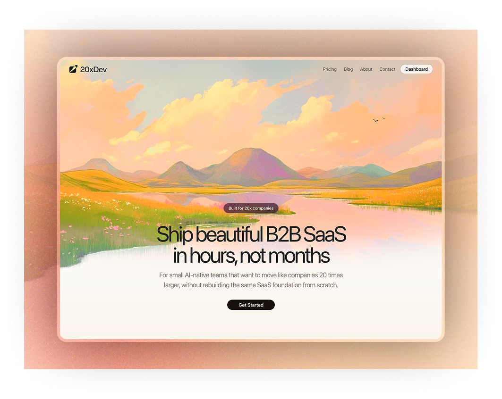
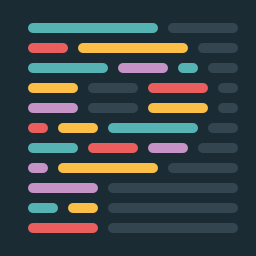

# 20xdev: AI SaaS Toolkit, B2B SaaS Starter, Next.js SaaS Boilerplate

<p>
  
</p>

20xdev is the current name of this project. This README reflects the repo as it exists today: what is already working, what is partially wired, and what still needs to be configured or built next.

## Current Status

The project already has a working foundation for:

- Marketing site and public pages
- Email/password auth with WorkOS AuthKit
- Multi-organization flows with WorkOS widgets
- Convex-backed app data
- Protected dashboard area
- Items and files CRUD flows
- Blog and Sanity Studio integration
- Basic internationalization plumbing with General Translation
- Optional PostHog client instrumentation

The project does **not** yet have real application code for several technologies that are still mentioned in the website stack showcase or older docs. The logo checklist below is the source of truth.

## Technology Status

### Core and frontend

| Done | Logo | Technology | Status | Notes |
|---|---|---|---|---|
| [x] |  | Next.js 16 | Implemented | App Router foundation is in place |
| [x] |  | TypeScript 5 | Implemented | Main app is typed |
| [x] |  | Bun | Implemented | Package manager and scripts |
| [x] |  | Tailwind CSS 4 | Implemented | Styling foundation |
| [x] |  | shadcn/ui | Implemented | Core component layer |
| [ ] |  | Animate UI | Not implemented | Mentioned in website stack, not wired in app code |

### Data, auth, and app infrastructure

| Done | Logo | Technology | Status | Notes |
|---|---|---|---|---|
| [x] |  | Convex | Implemented | Schema, tables, queries, mutations, auth component |
| [x] |  | Zod | Implemented | Validation schemas present |
| [x] |  | WorkOS | Implemented | Auth, organizations, widgets |
| [x] |  | TanStack Query | Implemented | Query provider present |
| [x] |  | nuqs | Implemented | URL state integration present |

### Content, analytics, and localization

| Done | Logo | Technology | Status | Notes |
|---|---|---|---|---|
| [x] |  | Sanity | Implemented | Blog, Studio, schemas, webhook route |
| [x] |  | PostHog | Implemented | Client integration exists in the app |
| [ ] |  | General Translation | Partial | Package and locale config exist, app-wide localization is incomplete |
| [ ] |  | DataFast | Not implemented | Mentioned only |
| [ ] |  | IndexNow | Not implemented | Mentioned only |
| [x] |  | Cal.com | Implemented | Discovery call link is connected in the contact flow |

### Revenue, onboarding, AI, and support

| Done | Logo | Technology | Status | Notes |
|---|---|---|---|---|
| [ ] |  | Stripe | Not implemented | Planned via `@convex-dev/stripe` |
| [ ] |  | Resend | Not implemented | Planned via `@convex-dev/resend` |
| [ ] |  | OpenAI | Not implemented | Requested for command/chat page |
| [ ] |  | Featurebase | Not implemented | Roadmap/changelog/docs still to set up |
| [ ] |  | Onboarda | Not implemented | Requested onboarding setup |
| [ ] |  | AffiliateBase | Not implemented | Requested affiliate/revenue setup |

### Code quality

| Done | Logo | Technology | Status | Notes |
|---|---|---|---|---|
| [ ] |  | Knip | Partial | Installed but not scripted or enforced |
| [ ] |  | CodeRabbit | Not implemented | Mentioned in docs, not configured in repo |
| [x] |  | SonarCloud | Implemented | GitHub Action present |
| [x] |  | Prettier | Implemented | Formatter configured |

## Features Already Built

- Public landing pages: home, pricing, about, contact, blog, privacy, terms
- Auth routes: login, signup, forgot password, update password
- Dashboard shell and protected layout
- Organization create, switch, update, and delete flows
- Convex tables for users, organizations, items, and files
- File upload UI and file listing flows
- Blog category pages and post detail pages
- Sanity revalidation endpoint at `/api/revalidate`
- WorkOS token endpoints for widgets

## Environment Variables In Use

These variables are referenced by the current codebase or scripts:

| Variable | Required | Purpose |
|---|---|---|
| `NEXT_PUBLIC_CONVEX_URL` | Yes | Convex client URL used by the app |
| `CONVEX_DEPLOY_KEY` | Production only | Required when production builds should deploy Convex |
| `WORKOS_API_KEY` | Yes | WorkOS server SDK |
| `WORKOS_CLIENT_ID` | Yes | WorkOS AuthKit / OAuth flows |
| `WORKOS_COOKIE_PASSWORD` | Yes | Session encryption |
| `WORKOS_REDIRECT_URI` | Yes | WorkOS callback URL |
| `NEXT_PUBLIC_APP_URL` | Recommended | Canonical app URL, used in blog metadata |
| `NEXT_PUBLIC_CAL_DISCOVERY_CALL_URL` | Optional | Contact page booking link |
| `NEXT_PUBLIC_SANITY_PROJECT_ID` | Yes for Sanity | Sanity client and Studio config |
| `NEXT_PUBLIC_SANITY_DATASET` | Yes for Sanity | Sanity dataset |
| `SANITY_REVALIDATE_SECRET` | Needed for webhook revalidation | Validates Sanity webhook requests |
| `SANITY_API_TOKEN` | Optional | Used by `scripts/seed-content.mjs` |
| `NEXT_PUBLIC_POSTHOG_KEY` | Optional | Enables PostHog in the frontend |
| `NEXT_PUBLIC_POSTHOG_HOST` | Optional | Overrides default PostHog host |
| `NEXT_PUBLIC_POSTHOG_DEV` | Optional | Allows PostHog during development |

## Product And Setup Checklist

Use this as the current operational checklist for the project and the requested product roadmap.

### Core setup

- [x] Next.js 16 app router foundation
- [x] TypeScript and Bun setup
- [x] Tailwind CSS 4 and shadcn/ui
- [x] Convex schema and generated API
- [x] WorkOS auth flows in app code
- [x] Sanity Studio and blog integration
- [x] Dashboard, items, and files sections
- [x] General Translation package installed and locale config present
- [x] SonarCloud GitHub Action present

### Environment and deployment

- [ ] Add a safe `.env.example` file that matches the variables used in the app
- [ ] Move all real secrets out of tracked/local shared files as needed and rotate any exposed credentials
- [ ] Confirm production `NEXT_PUBLIC_APP_URL`
- [ ] Confirm production `WORKOS_REDIRECT_URI`
- [ ] Confirm production `NEXT_PUBLIC_CONVEX_URL`
- [ ] Confirm `CONVEX_DEPLOY_KEY` is set for production deploys

### WorkOS

- [x] Email/password auth flow
- [x] Callback route
- [x] Organization create/list/switch flows
- [x] WorkOS widget token endpoints
- [ ] Verify final production WorkOS application settings
- [ ] Verify production redirect/callback domain configuration

### Billing and plans with Stripe

The requested implementation is Stripe with free trial and multiple plans, using the official Convex Stripe component. Convex’s official docs support installing the component from npm and mounting it through `convex/convex.config.ts`. Verified sources:
[Stripe component](https://www.convex.dev/components/stripe), [Using Components](https://docs.convex.dev/components/using-components)

- [ ] Install `@convex-dev/stripe`
- [ ] Add the Stripe component in `convex/convex.config.ts`
- [ ] Run `npx convex dev` to generate component bindings
- [ ] Define billing model:
- [ ] Free plan
- [ ] Pro plan
- [ ] Team or Enterprise plan
- [ ] Configure free trial duration and trial eligibility rules
- [ ] Create Stripe products and prices
- [ ] Add required Stripe environment variables and secrets
- [ ] Create Convex actions/mutations for checkout and subscription lifecycle
- [ ] Handle subscription sync between Stripe and Convex
- [ ] Add billing UI in dashboard settings
- [ ] Add pricing page connection to real Stripe checkout
- [ ] Define upgrade, downgrade, cancel, and trial-expired flows
- [ ] Verify webhook handling and subscription state reconciliation

### Email and lifecycle messaging with Resend

The requested implementation is Resend through the official Convex Resend component. Convex’s official docs support the component model and Convex’s component directory includes the Resend integration. Verified sources:
[Resend component](https://www.convex.dev/components/resend), [Using Components](https://docs.convex.dev/components/using-components)

- [ ] Install `@convex-dev/resend`
- [ ] Add the Resend component in `convex/convex.config.ts`
- [ ] Run `npx convex dev` to generate component bindings
- [ ] Add Resend API credentials to environment management
- [ ] Build transactional email helpers in Convex actions
- [ ] Send welcome email after successful signup
- [ ] Send trial-start email
- [ ] Send trial-ending reminder email
- [ ] Send payment success / subscription updated email
- [ ] Send password reset email only through the chosen final flow if needed
- [ ] Add email templates and basic delivery/error logging

### Onboarding and activation

- [ ] Set up Onboarda or decide on an in-house onboarding alternative
- [ ] Create first-run onboarding flow after signup
- [ ] Add checklist for core activation steps
- [ ] Add organization setup guidance
- [ ] Add empty states and guided next actions in dashboard
- [ ] Track onboarding completion milestones

### Affiliates and referrals

- [ ] Set up affiliate/revenue sharing platform
- [ ] Create public affiliate page
- [ ] Define commission structure and payout rules
- [ ] Add affiliate application / signup flow
- [ ] Add affiliate attribution and conversion tracking
- [ ] Add dashboard or back office view for affiliate performance

### Roadmap, changelog, and documentation hub

- [ ] Set up Featurebase or chosen roadmap platform
- [ ] Add public roadmap page
- [ ] Add changelog page
- [ ] Add feedback board / feature request intake
- [ ] Add documentation/help center link in app and marketing site
- [ ] Decide where product docs live and connect nav/footer links

### Search indexing and SEO operations

- [ ] Set up IndexNow if it remains in scope
- [ ] Verify sitemap and robots strategy
- [ ] Verify metadata for marketing pages and blog
- [ ] Decide whether blog publishing should trigger indexing pings
- [ ] Verify canonical URLs and production domain consistency

### Convex

- [x] Users table
- [x] Organizations table
- [x] Items table
- [x] Files table
- [x] Convex auth integration with WorkOS
- [ ] Confirm production deployment wiring end to end

### Sanity

- [x] Sanity client
- [x] Sanity Studio route
- [x] Blog schemas and queries
- [x] Revalidation route
- [ ] Add `SANITY_REVALIDATE_SECRET`
- [ ] Configure the Sanity webhook to call `/api/revalidate`
- [ ] Add `SANITY_API_TOKEN` if content seeding is needed

### PostHog

- [x] Frontend PostHog wrapper/provider exists
- [ ] Add `NEXT_PUBLIC_POSTHOG_KEY`
- [ ] Add `NEXT_PUBLIC_POSTHOG_HOST` if needed
- [ ] Decide whether tracking should run in development via `NEXT_PUBLIC_POSTHOG_DEV`
- [ ] Verify pageview/session/error tracking in a real PostHog project

### Internationalization

- [x] `gt-next` installed
- [x] `en` and `it` locales configured
- [ ] Finish applying translations consistently across the app
- [ ] Verify language switching and untranslated states

### Calendar and agenda

- [ ] Create agenda page
- [ ] Decide whether agenda is read-only calendar sync or full scheduler
- [ ] Connect Google Calendar API
- [ ] Define OAuth scopes and token storage strategy
- [ ] Sync events into Convex or fetch directly depending on product needs
- [ ] Add event error handling and reconnect flow
- [ ] Decide whether agenda should also expose booking or availability controls

### AI command/chat page

- [ ] Create command page / chat page
- [ ] Decide provider: Grok, OpenAI, or both
- [ ] Add provider API key configuration
- [ ] Define conversation storage model
- [ ] Add streaming response UX
- [ ] Add rate limiting and usage controls
- [ ] Add error states for provider/API failures
- [ ] Decide whether chat is per-user, per-organization, or shared workspace

### CSV import and inline editing

- [ ] Build CSV import flow
- [ ] Support dynamic column mapping
- [ ] Validate rows before import
- [ ] Add import error management with row-level feedback
- [ ] Add partial success handling
- [ ] Persist import audit results or summary logs
- [ ] Build single-page inline editing experience for imported records
- [ ] Add optimistic updates or explicit save states
- [ ] Add validation and conflict handling for inline edits

### Code quality and CI

- [x] ESLint
- [x] Prettier
- [x] SonarCloud workflow
- [ ] Add a `knip` script to `package.json`
- [ ] Decide whether to run Knip in CI
- [ ] Decide whether CodeRabbit should actually be configured or removed from project messaging

### Mentioned in docs or marketing but not implemented yet

- [ ] Stripe implementation
- [ ] Resend implementation
- [ ] OpenAI
- [ ] DataFast
- [ ] Featurebase
- [ ] IndexNow
- [ ] Onboarda
- [ ] AffiliateBase

These may still be part of the intended roadmap, but they are not configured as active runtime integrations in the current codebase.

## Local Development

This repo uses Bun.

```bash
bun install
npx convex dev
bun dev
```

Useful commands:

```bash
bun run dev
bun run build
bun run start
bun run lint
bun run typecheck
bun run check
bun run format
```

Notes:

- `bun run build` triggers `convex deploy` only when `VERCEL_ENV=production`.
- `scripts/setup.sh` expects `.env.example`, but that file does not currently exist.
- Sanity Studio is available at `/studio`.

## Project Structure

```text
src/
  app/                 Next.js App Router pages, layouts, and route handlers
  components/          Shared UI and layout components
  config/              Site-wide config
  hooks/               Custom React hooks
  lib/                 Utilities and integration helpers
  providers/           App providers
  sanity/              Sanity client, config, schemas
  types/               Shared TypeScript types

convex/
  functions/           Queries and mutations
  tables/              Table definitions
  schema.ts            Combined Convex schema
  auth.ts              Convex auth integration
```

## Recommended Next Steps

1. Complete the Environment and deployment checklist first.
2. Implement Stripe plans/trials and Resend welcome email flows through Convex Components.
3. Decide the product owner choices that affect architecture: Google Calendar sync model, chat provider, affiliate platform, and roadmap/docs platform.
4. Build the new product surfaces in this order: billing, onboarding, docs/roadmap, agenda, chat, CSV import with inline editing.
5. Remove any marketing claims that are still not backed by implementation.

## License

MIT
